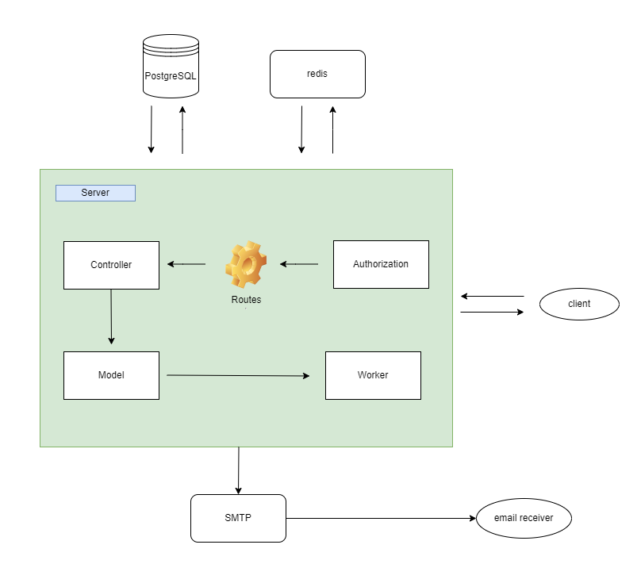

# README - Mail Stations


**Mail Station** is a REST API that developed to sending emails that will be enqueueing all  of the Mail data that any users has created.

This API has been developed by using PHP, PostgreSQL, and Redis. At first Clint have to make a request with Bearer Token credential, then if the Mail data is valid, it will be stored on the database and enqueued right away to the mailer queue managed by Redis, and then the worker will be sending the emails in order.



## Requirement
  - PostgreSQL
  - Redis
  - Composer v. 2.2.6
  - PHP v. 8.1.2


## Run the code linter
Use ```php code_checker.php``` command to run the code linter.

## Run the Server
There are two ways to run this API, you can run it using the docker or start the server manually. But first you have to set the required variables on the mailer config. Open the ```mailer.php``` and set the value of the ```SMTP_HOST```, ```SMTP_PORT```, ```SMTP_USER```, ```SENDER_MAIL```, and ```SMTP_PASSWORD```.

Here follows an example of the mailer configuration.
```php
<?php
class Mailer {
  public static $mailerHost = 'smtp.gmail.com';
  public static $mailerPort = '587';
  public static $mailerUser = 'dheris@gmail.com';
  public static $mailerFrom = 'dheris@gmail.com';
  public static $mailerPass = 'x344ffda6156';
}
?>
```

### 1. Run using Docker
You just have to run the ```docker-compose up ``` command to start the server.

### 2. Run Manually
Because you are going to run the server manually, Make sure that the **posgresql** and **redis** services already running.

First, we have to change the ```database.php``` configuration. Change all of the variable to your current PostgreSQL setting.

Second, We have to install all of the needed libraries. Run ```composer install``` and ```composer dump-autoload``` to prepare the autoload files.

Then we are going to process the database migration. Run ```php config/migration/migrate.php```.

Lastly before we start the server, we are going to use the **nohup** command for starting the worker service by running ```nohup php worker.php &``` command. And after the worker service run, we can start to run the server. Run ```php -S localhost:8000``` to do so.

# API Usage
You can use this [Postman Documentation](https://www.postman.com/planetary-desert-155889/workspace/mail-stations/collection/18529314-fb82c898-a18a-4838-8a6b-3bb59fb1ceb7?action=share&creator=18529314&active-environment=18529314-131bdcfb-9ce3-48ca-bb25-72da2edc1294) to learn how to use the Mail Station API.

There are 5 types of endpoint for the mailers API:
<br>
**1. List Mail**
<br>
  &emsp;List Email is and endpoint to listing the emails that already created.
<br>
<br>
**2. Create Mail**
<br>
  &emsp;This is the main endpoint, this request is used to create the Mail data, before it got enqueued, the status of the mail will be **pending**, and after it has been processed by the worker, the status will be changing to **sent** or **failed**, which describing if the mail successfully sent or failed.
<br>
<br>
**3. Show Mail**
<br>
  &emsp;The show mail request is use for accessing the Mail data based on the id of the Mail.
<br>
<br>
**4. Update Status Mail**
<br>
  &emsp;This endpoint is the request for updating the mail status.
<br>
<br>
**5. Delete Mail**
<br>
  &emsp;If you wanted to delete certain Mail data, you can use this endpoint.

***Important: the API is using Bearer Key API. So, pay attention to not made any change to the authorization setting of the Postman documentation.***